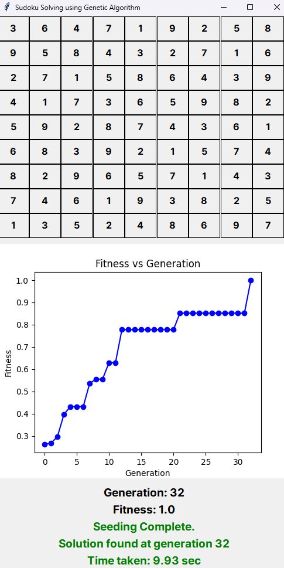

# Sudoku Solver with Tkinter Interface

This project is a Sudoku solver implemented in Python with a Tkinter graphical user interface. The core genetic algorithm code was borrowed from [ctjacobs/sudoku-genetic-algorithm](https://github.com/ctjacobs/sudoku-genetic-algorithm), and a Tkinter interface has been added for ease of use.

## Prerequisites

Before running the Sudoku solver, make sure that you have Tkinter installed. Tkinter is included in the standard library for most Python installations, but you can install it if needed:

```bash
pip install tk
```

## Getting Started

Clone or fork this repository and navigate to the project directory. To run the Sudoku solver, execute the following command:

```bash
python sudoku.py
```

This will launch the Tkinter interface, allowing you to interact with the Sudoku solver.

By default, the solver uses the input file `./instances/instance-1.txt`. You can change the input file path by modifying the following line in the `sudoku.py` file (line 643):

```python
s.load("./instances/instance-1.txt")
```

Replace `./instances/instance-1.txt` with the path to your desired input file.

## Usage

1. Run `sudoku.py` using the command mentioned above.
2. The Tkinter interface will open.
3. Optionally, modify the input file path in the source code if needed.
4. Click the "Solve" button to let the genetic algorithm solve the Sudoku puzzle.

## Screenshots



## Acknowledgments

- Original genetic algorithm code by [ctjacobs](https://github.com/ctjacobs/sudoku-genetic-algorithm)

Feel free to contribute to the project or report issues on the [GitHub repository](https://github.com/your-username/your-repo).

Happy Sudoku solving!